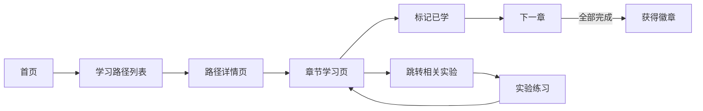
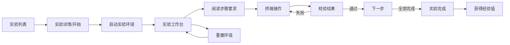
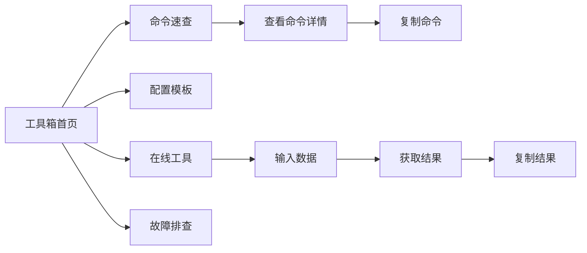

# IT运维通平台 - 产品需求文档（PRD）

## 1. 产品概述

IT运维通是一款面向IT职场新人的一站式运维技能学习与实战平台，帮助零基础小白通过体系化课程、在线实验环境和运维工具箱，快速掌握运维核心技能。

- 目标用户：运维实习生、刚毕业的运维岗新人、转岗运维的程序员
- 核心价值：清晰的学习路径 + 真实的实验环境 + 实用的运维工具
- 产品愿景：成为国内最大的运维新人成长社区

---

## 2. 核心功能

### 2.1 用户角色

| 角色 | 注册方式 | 核心权限 |
|------|----------|----------|
| 普通用户 | 手机号/邮箱注册 | 浏览课程、使用工具箱、参与实验、查看个人进度 |

### 2.2 功能模块

1. **首页**：导航栏、欢迎卡片、继续学习、推荐路径、常用工具、今日一坑
2. **学习路径**：路径列表、路径详情、章节学习（Markdown渲染 + 代码高亮）
3. **运维工具箱**：命令速查、配置模板、在线工具（时间戳/JSON/Base64等）、故障排查
4. **在线实验平台**：实验列表、实验工作台（Web Terminal + 步骤引导）
5. **个人中心**：学习统计、学习日历、技能树、徽章成就、账号设置

### 2.3 页面详情

| 页面名称 | 模块名称 | 功能描述 |
|----------|----------|----------|
| 首页 | 顶部导航 | 全局导航，包含Logo、菜单、用户头像 |
| 首页 | 欢迎卡片 | 展示用户昵称、今日学习目标、连续学习天数、进度概览 |
| 首页 | 继续学习 | 展示最近学习的路径和实验，一键继续 |
| 首页 | 推荐路径 | 卡片式展示所有学习路径，按入门/进阶/高级分类 |
| 首页 | 常用工具 | 工具快捷入口，支持自定义排序 |
| 首页 | 今日一坑 | 每日推荐一个运维踩坑案例 |
| 学习路径列表页 | 搜索筛选 | 关键词搜索、标签筛选、排序方式 |
| 学习路径列表页 | 路径卡片 | 封面、标题、简介、时长、章节数、学习人数、评分、进度 |
| 章节学习页 | 左侧目录 | 章节列表，可折叠，高亮当前章节 |
| 章节学习页 | 内容区 | Markdown渲染、代码高亮、一键复制、跳转实验 |
| 章节学习页 | 底部操作 | 上一章/下一章、标记已学 |
| 工具箱首页 | 搜索栏 | 全局搜索命令/工具/模板 |
| 工具箱首页 | 我的常用 | 6个最常用工具快捷入口 |
| 工具箱首页 | 命令速查分类 | 8大分类卡片，每类显示命令数量 |
| 工具箱首页 | 配置模板 | 常用配置模板卡片，一键复制 |
| 工具箱首页 | 在线工具 | JSON格式化、时间戳转换、Base64等小工具 |
| 命令详情页 | 左侧分类 | 命令分类导航 |
| 命令详情页 | 内容区 | 语法、选项、常用组合、实战示例、老司机经验 |
| 实验列表页 | 筛选区 | 难度筛选、分类标签、实验时长概览 |
| 实验列表页 | 实验卡片 | 标题、简介、难度、时长、完成率、参与人数 |
| 实验工作台 | 左侧步骤 | 实验步骤导航、任务要求、提示按钮 |
| 实验工作台 | 右侧终端 | Web Terminal，支持复制粘贴、历史记录 |
| 实验工作台 | 底部操作 | 重置环境、跳过、下一步 |
| 个人中心 | 个人信息 | 头像、昵称、等级、经验值、签名、徽章 |
| 个人中心 | 数据概览 | 总学习时长、完成路径数、完成实验数、学习天数 |
| 个人中心 | 学习日历 | 每日学习打卡热力图 |
| 个人中心 | 技能树 | 可视化技能掌握程度 |
| 个人中心 | 继续学习 | 最近学习内容快捷入口 |

---

## 3. 核心流程

### 3.1 学习流程

用户从首页或路径列表选择一条学习路径 → 查看路径详情 → 开始第一章学习 → 阅读图文内容 → 标记已学 → 继续下一章 → 完成路径后获得徽章

### 3.2 实验流程

用户选择实验 → 启动实验环境 → 按照步骤完成任务 → 系统自动校验 → 完成实验获得经验值

### 3.3 工具使用流程

用户进入工具箱 → 搜索或选择工具 → 使用工具 → 复制结果

---

## 4. 用户界面设计

### 4.1 设计风格

- **设计方向**：科技极客风 + 深色模式友好。运维工程师偏爱深色主题，整体风格简洁专业，带有科技感。
- **主色调**：科技蓝 `#1677ff`，代表专业和信任
- **辅助色**：成功绿 `#52c41a`、警告黄 `#faad14`、错误红 `#ff4d4f`、信息青 `#13c2c2`
- **背景色**：
  - 浅色模式：`#f5f7fa`（页面背景）、`#ffffff`（卡片背景）
  - 深色模式：`#0f172a`（页面背景）、`#1e293b`（卡片背景）
- **按钮风格**：圆角 6px，主按钮蓝色填充，次要按钮边框描边
- **字体**：
  - 正文字体：`"PingFang SC", "Microsoft YaHei", system-ui, sans-serif`
  - 代码字体：`"JetBrains Mono", "Fira Code", monospace`
- **布局风格**：卡片式布局，顶部导航 + 左侧目录（学习/实验页）+ 主内容区
- **图标风格**：线性图标（Ant Design Icons），搭配emoji增强亲和力
- **终端风格**：深色背景 + 绿色/白色文字，经典黑客终端视觉

### 4.2 页面设计概览

| 页面名称 | 模块名称 | UI元素 |
|----------|----------|--------|
| 首页 | 顶部导航 | 固定顶部、科技蓝背景、hover动效、下拉菜单 |
| 首页 | 欢迎卡片 | 渐变背景、大号数字、火焰图标（连续学习） |
| 首页 | 路径卡片 | 封面图 + 信息叠加、进度条动画、hover上浮 |
| 首页 | 工具入口 | 圆角图标卡、彩色背景、可拖拽排序 |
| 章节学习页 | 左侧目录 | 可收起侧边栏、进度条、当前章节高亮 |
| 章节学习页 | 内容区 | 舒适行高、代码块语法高亮、复制按钮 |
| 命令详情页 | 内容区 | 表格样式、代码块、提示框（老司机经验） |
| 实验工作台 | 终端区 | 黑色背景、等宽字体、闪烁光标、模拟终端效果 |
| 实验工作台 | 步骤区 | 步骤进度线、任务列表（复选框）、提示折叠 |
| 个人中心 | 技能树 | 树形结构、节点状态颜色区分、连接线动画 |
| 个人中心 | 学习日历 | 热力图样式、深浅颜色表示学习时长 |

### 4.3 响应式

- 桌面端优先设计（1280px以上）
- 平板端（768-1279px）：侧边栏可收起，卡片自适应排列
- 移动端（768px以下）：汉堡菜单、单列布局、实验页提示建议使用PC端
- 触控优化：按钮最小44px触控区域

### 4.4 动效设计

- 页面切换：淡入 + 轻微上移
- 卡片hover：上浮2px + 阴影加深
- 进度条：宽度渐变动画
- 终端：光标闪烁动画
- 徽章获得：缩放 + 光晕效果
- 滚动导航：顶部导航栏背景渐变加深
