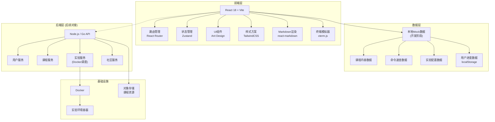
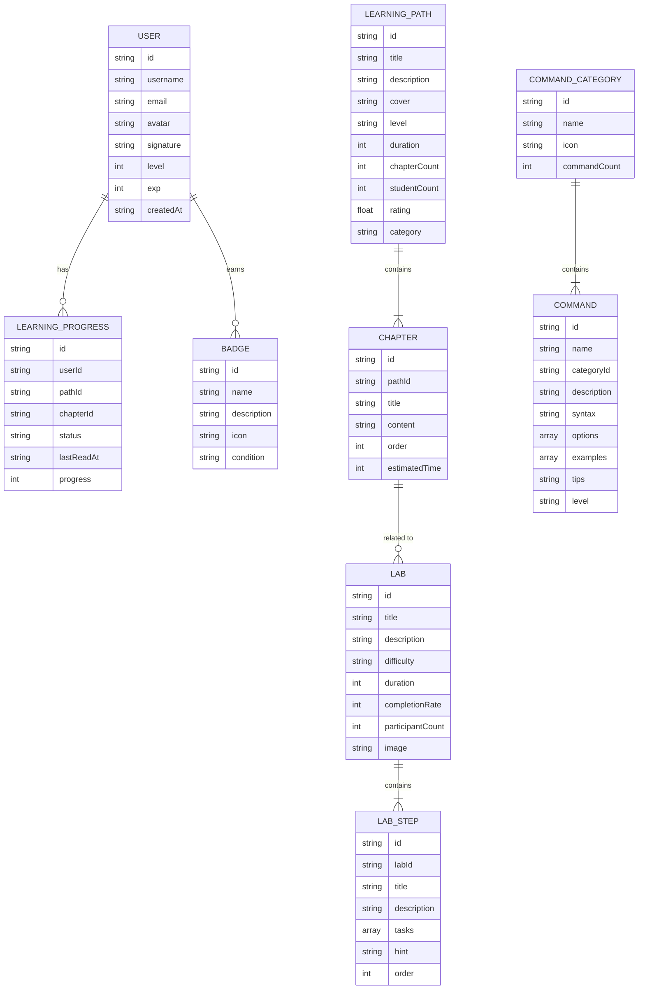

# IT运维通平台 - 技术架构文档

## 1. 架构设计



**架构说明：**
- MVP阶段采用纯前端 + Mock数据模式，快速验证产品
- 用户进度数据存储在 localStorage
- 实验平台MVP使用模拟终端（后续接入Docker）
- 数据与组件分离，方便后续接入真实后端API

---

## 2. 技术描述

### 2.1 前端技术栈

| 技术 | 版本 | 用途 |
|------|------|------|
| React | 18.x | 前端框架 |
| TypeScript | 5.x | 类型安全 |
| Vite | 5.x | 构建工具 |
| React Router | 6.x | 路由管理 |
| Zustand | 4.x | 状态管理 |
| Ant Design | 5.x | UI组件库 |
| TailwindCSS | 3.x | CSS框架 |
| react-markdown | 9.x | Markdown渲染 |
| react-syntax-highlighter | 15.x | 代码高亮 |
| xterm | 5.x | 终端模拟器 |
| @ant-design/icons | 5.x | 图标库 |
| dayjs | 1.x | 日期处理 |

### 2.2 初始化方式

使用 Vite 官方模板初始化：
```bash
npm create vite@latest . -- --template react-ts
```

### 2.3 后端（MVP阶段）

- **无真实后端**：采用本地Mock数据 + localStorage 持久化
- 数据以 TypeScript 接口定义，后续可无缝切换为 API 调用

### 2.4 实验环境（MVP阶段）

- 使用 **xterm.js** 模拟终端界面
- MVP阶段使用前端模拟命令执行（fake-shell）
- 真实Docker环境作为V2.0规划

---

## 3. 路由定义

| 路由路径 | 页面名称 | 说明 |
|----------|----------|------|
| `/` | 首页 | 欢迎卡片、继续学习、推荐路径、常用工具 |
| `/paths` | 学习路径列表 | 所有学习路径展示、筛选搜索 |
| `/paths/:id` | 路径详情 | 路径介绍、章节列表 |
| `/paths/:id/chapter/:chapterId` | 章节学习 | 课程内容阅读 |
| `/tools` | 工具箱首页 | 工具分类入口 |
| `/tools/commands` | 命令速查列表 | 命令分类 + 列表 |
| `/tools/commands/:cmd` | 命令详情 | 单个命令详细说明 |
| `/tools/templates` | 配置模板 | 配置模板列表 |
| `/tools/json-formatter` | JSON格式化 | JSON格式化工具 |
| `/tools/timestamp` | 时间戳转换 | 时间戳转换工具 |
| `/tools/base64` | Base64编解码 | Base64工具 |
| `/tools/regex` | 正则测试 | 正则表达式测试器 |
| `/labs` | 实验列表 | 实验展示、筛选 |
| `/labs/:id` | 实验工作台 | 在线实验操作界面 |
| `/profile` | 个人中心 | 学习统计、技能树、徽章 |
| `/profile/settings` | 账号设置 | 个人信息修改 |
| `/login` | 登录页 | 用户登录 |
| `/register` | 注册页 | 用户注册 |

---

## 4. 目录结构

```
src/
├── assets/              # 静态资源
│   ├── images/          # 图片
│   └── styles/          # 全局样式
├── components/          # 公共组件
│   ├── layout/          # 布局组件
│   │   ├── Header.tsx   # 顶部导航
│   │   ├── Sidebar.tsx  # 侧边栏
│   │   └── Footer.tsx   # 页脚
│   ├── common/          # 通用组件
│   │   ├── Card.tsx
│   │   ├── ProgressBar.tsx
│   │   └── Empty.tsx
│   └── terminal/        # 终端组件
│       └── Terminal.tsx
├── pages/               # 页面组件
│   ├── home/
│   ├── paths/
│   ├── tools/
│   ├── labs/
│   ├── profile/
│   └── auth/
├── store/               # 状态管理
│   ├── userStore.ts
│   ├── learningStore.ts
│   └── toolStore.ts
├── data/                # Mock数据
│   ├── paths.ts         # 学习路径数据
│   ├── commands.ts      # 命令数据
│   ├── templates.ts     # 配置模板
│   ├── labs.ts          # 实验数据
│   └── badges.ts        # 徽章数据
├── types/               # TypeScript类型定义
│   ├── path.ts
│   ├── command.ts
│   ├── lab.ts
│   └── user.ts
├── hooks/               # 自定义Hooks
│   ├── useLearning.ts
│   └── useTerminal.ts
├── utils/               # 工具函数
│   ├── storage.ts       # 本地存储
│   ├── format.ts        # 格式化工具
│   └── validator.ts     # 校验工具
├── router/              # 路由配置
│   └── index.tsx
├── App.tsx
└── main.tsx
```

---

## 5. 数据模型

### 5.1 数据模型定义



### 5.2 Mock数据结构示例

**学习路径数据：**
```typescript
interface LearningPath {
  id: string;
  title: string;
  description: string;
  cover: string;
  level: 'beginner' | 'intermediate' | 'advanced';
  duration: number;
  chapterCount: number;
  studentCount: number;
  rating: number;
  category: string;
  chapters: Chapter[];
}

interface Chapter {
  id: string;
  title: string;
  content: string;
  order: number;
  estimatedTime: number;
  relatedLabId?: string;
}
```

**命令数据：**
```typescript
interface Command {
  id: string;
  name: string;
  categoryId: string;
  description: string;
  syntax: string;
  options: {
    flag: string;
    description: string;
  }[];
  combinations: string[];
  examples: {
    title: string;
    code: string;
    output?: string;
  }[];
  tips: string;
  level: 'beginner' | 'intermediate' | 'advanced';
}
```

---

## 6. 核心功能实现方案

### 6.1 Markdown渲染方案

使用 `react-markdown` + `react-syntax-highlighter` 实现：
- 支持标准Markdown语法
- 代码块语法高亮（支持多种语言）
- 一键复制代码功能
- 自定义样式主题（深色/浅色）

### 6.2 终端模拟器方案

使用 `xterm.js` 实现：
- 真实终端外观和交互
- 支持键盘输入、复制粘贴
- 命令历史记录（↑↓）
- Tab补全（基础支持）
- MVP阶段使用前端模拟shell执行

### 6.3 学习进度持久化

使用 `localStorage` + Zustand：
- 学习进度自动保存
- 页面刷新不丢失
- 多设备同步（后续接入后端）

### 6.4 响应式方案

TailwindCSS断点：
- `sm`: 640px（手机横屏）
- `md`: 768px（平板）
- `lg`: 1024px（笔记本）
- `xl`: 1280px（桌面）
- `2xl`: 1536px（大屏）

---

## 7. 性能优化

| 优化点 | 方案 |
|--------|------|
| 代码分割 | React.lazy + React Router 路由级分割 |
| 图片优化 | WebP格式 + 懒加载 + 占位符 |
| 首屏加载 | 关键CSS内联、预加载核心资源 |
| 状态更新 | Zustand 精准订阅，避免不必要渲染 |
| 列表性能 | 长列表虚拟滚动（命令列表等） |
| 打包优化 | Tree Shaking、按需引入、Gzip压缩 |

---

## 8. 开发规范

### 8.1 命名规范

- 组件：`PascalCase`（如 `HeaderNav.tsx`）
- 变量/函数：`camelCase`
- 常量：`UPPER_SNAKE_CASE`
- 类型/接口：`PascalCase`，接口加 `I` 前缀可选
- 文件：组件用 `PascalCase`，工具用 `camelCase`

### 8.2 代码规范

- ESLint + Prettier 代码格式化
- TypeScript 严格模式
- 组件单一职责
- 优先使用函数组件 + Hooks
- 避免 `any` 类型

### 8.3 Git规范

- 分支：`main` / `dev` / `feature/xxx`
- Commit格式：`type: description`
  - `feat`: 新功能
  - `fix`: 修复
  - `docs`: 文档
  - `style`: 样式
  - `refactor`: 重构
  - `chore`: 构建/工具
